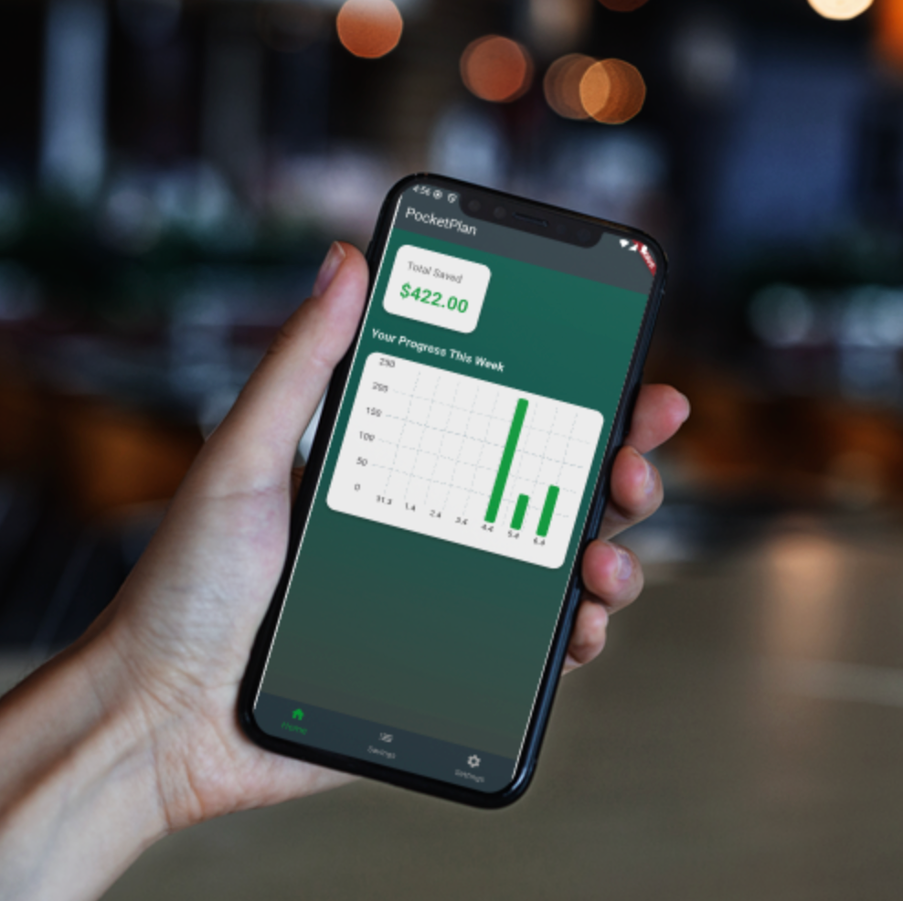
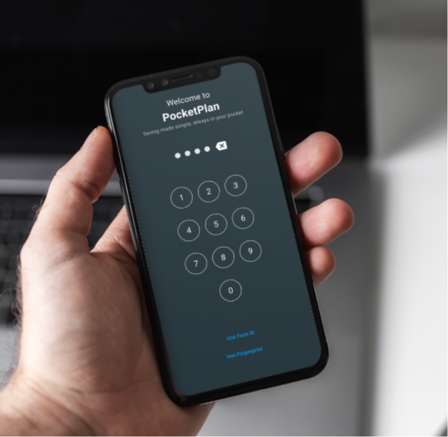
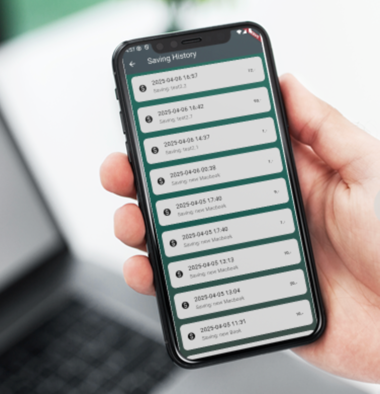

# PocketPlan

**PocketPlan**  
Saving made simple, always in your pocket.

PocketPlan makes saving easy and intuitive — track goals, build habits, and manage your money effortlessly, all in one sleek app that fits right in your pocket.

[Visit the landing page](https://pocket-plan.vercel.app/)

Grab the APK from: pocketplan_web/assets/pocketplan.apk

## Features
- 📈 **Track Saving Goals**: Easily set and track your saving goals.
- 💰 **Add Money Progress**: Add money to goals and see your progress instantly.
- 🔒 **Secure with PIN**: Protect your savings with a PIN.
- 🎯 **Set Monthly Limits**: Control your monthly savings with an optional limit.
- ✨ **Easy to Use**: Minimalist design with an intuitive interface.

## Screenshots

  

## How to Use PocketPlan

### 1. Add a Saving Goal
- Tap “New Saving”, enter a title (e.g. “New iPhone”) and target amount (e.g. €1000), then save.
- ✅ Your goal appears in the overview.

### 2. View Saved Amount History
- Tap “See Amount History” Button (bottom right)
- ✅ You’ll see a list of all contributions.

### 3. Edit a Saving Goal
- Tap “Edit Icon” on a goal, update the target (e.g. to €1200), and save.
- ✅ The new target is saved and shown.

### 4. Delete a Goal
- Tap “Delete Icon” and confirm with “Yes, delete”.
- ✅ The goal is removed from your list.

### 5. Add Money to a Goal
- Tap “Add Icon”, enter how much you saved.
- ✅ Your progress updates instantly.

### 6. Unlock with Password
- If “Password when Log in” is enabled, the app asks for your PIN on launch.
- ✅ Enter the correct PIN to access the App.

### 7. Set a Monthly Limit
- Go to Settings → “Saving Limits”, enter e.g. €200/month, and save.
- ✅ The limit is applied to your savings.

## Download APK

If you're ready to try PocketPlan, you can download the APK here:

[Download APK](https://pocket-plan.vercel.app/download)

## Tech Stack

- **Flutter**: Build and run the app on both Android and iOS.
- **SharedPreferences**: Store the user's PIN and other app settings.
- **Local Authentication**: Secure the app with biometric authentication (Face ID, Fingerprint).
- **Firebase (Optional)**: For cloud storage and authentication (if integrated).
